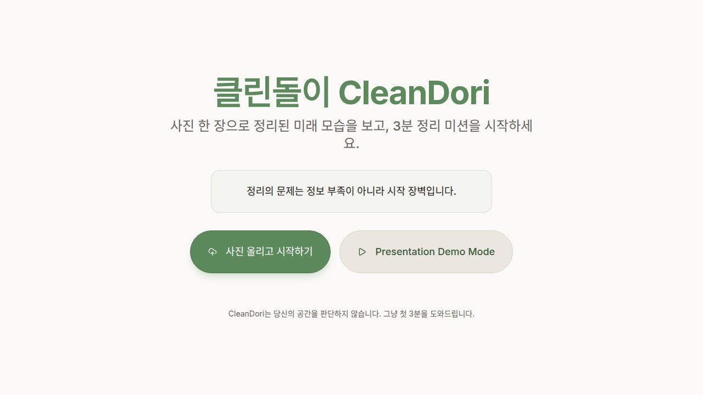
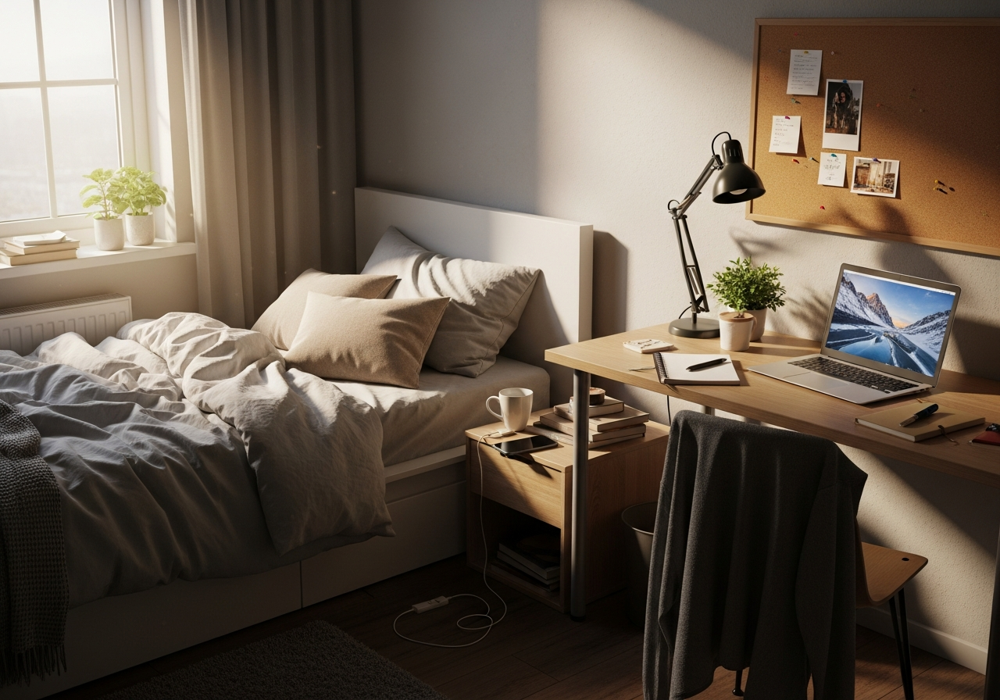
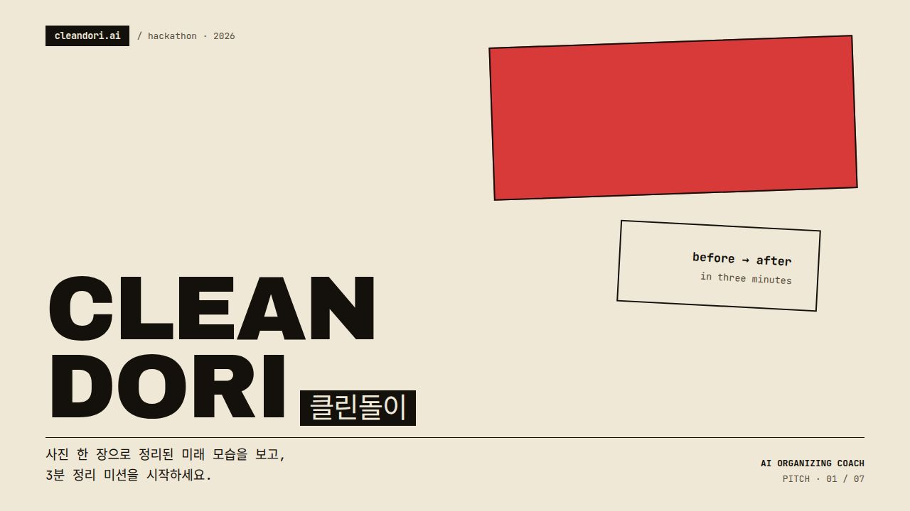

# 클린돌이 CleanDori 🧹

> **사진 한 장이면 충분합니다.** 어지러운 방 사진을 올리면, 정리된 미래 모습과 **딱 3분짜리 정리 미션**을 알려드려요.

<p align="center">
  <a href="https://clean-dori.replit.app/"><b>🌐 라이브 데모 바로가기 →  clean-dori.replit.app</b></a>
</p>

<p align="center">
  
</p>

---

## 🌱 CleanDori는 어떤 서비스인가요?

집이 어지러워서 막막할 때, 보통 우리는 이런 생각을 합니다.

- "어디서부터 손대야 하지…"
- "오늘은 도저히 에너지가 없어"
- "이걸 버려, 말아…?"

**CleanDori는 판단하지 않습니다.** 대신 *지금 당장 할 수 있는 가장 작은 한 걸음*만 알려줘요.

| 단계 | 사용자가 하는 일 | 클린돌이가 하는 일 |
| --- | --- | --- |
| 1️⃣ | 방 사진 한 장 올리기 | 사진 속 "정리의 장벽"을 분석 |
| 2️⃣ | 오늘 내 컨디션 고르기 (5가지) | 컨디션에 딱 맞는 1~10분 미션 생성 |
| 3️⃣ | 미션 따라 움직이기 | 정리된 "미래 모습" 미리 보여주기 |

> 💚 **핵심 철학** — *"정리의 문제는 정보 부족이 아니라 시작 장벽입니다."*

---

## 🖼️ 이렇게 바뀝니다

<table>
  <tr>
    <th align="center">Before · 지금 내 방</th>
    <th align="center">After · 3분 뒤 모습</th>
  </tr>
  <tr>
    <td></td>
    <td></td>
  </tr>
</table>

---

## 🎤 발표 슬라이드

해커톤 발표용 7장짜리 슬라이드 덱도 함께 들어 있어요.

<p align="center">
  
</p>

---

## 📂 프로젝트는 어떻게 구성되어 있나요?

이 저장소는 **하나의 큰 폴더 안에 여러 개의 작은 앱**이 들어 있는 구조(monorepo)예요.

```
Clean-Dori/
├── artifacts/
│   ├── cleandori/         🧹 메인 웹 앱 (사용자가 보는 화면)
│   ├── cleandori-deck/    🎤 발표용 슬라이드 덱
│   ├── api-server/        🔌 백엔드 API 서버
│   └── mockup-sandbox/    🎨 디자인 시안 작업용
├── lib/                   📦 여러 앱이 같이 쓰는 공용 코드
└── attached_assets/       🖼️ 이미지·스크린샷 모음
```

| 앱 | 무엇을 하나요? | 어디서 볼 수 있나요? |
| --- | --- | --- |
| **cleandori** | 사진 업로드 → AI 분석 → 미션 안내까지 전체 사용자 흐름 | 홈 화면 (`/`) |
| **cleandori-deck** | 해커톤 발표용 7장 슬라이드 | `/cleandori-deck` |
| **api-server** | 백엔드 API (현재는 데모 모드 위주) | `/api` |
| **mockup-sandbox** | 디자이너용 컴포넌트 미리보기 | 내부용 |

---

## 🛠️ 어떤 기술로 만들었나요?

- **프론트엔드**: React 19 + Vite + TypeScript + Tailwind CSS
- **UI 컴포넌트**: shadcn/ui (Radix UI 기반)
- **애니메이션**: Framer Motion
- **백엔드**: Node.js 24 + Express 5
- **데이터베이스**: PostgreSQL + Drizzle ORM
- **AI 연동**: Anthropic Claude (방 분석·미션) + OpenAI (After 이미지)
- **패키지 관리**: pnpm workspace (모노레포)

---

## 🚀 직접 실행해보고 싶다면

> 💡 **가장 쉬운 방법은 라이브 사이트에서 바로 체험하는 거예요 →** [https://clean-dori.replit.app/](https://clean-dori.replit.app/)
>
> 라이브 사이트는 Replit 환경에서 AI 키·DB·서비스 라우팅이 자동으로 묶여서 동작합니다.

### 옵션 A. Replit에서 바로 열기 (권장)

1. 이 저장소를 Replit으로 import 합니다.
2. 아래 시크릿을 Replit Secrets에 등록하세요. **이게 없으면 AI 기능이 동작하지 않습니다.**

   | 시크릿 이름 | 용도 | 없으면? |
   | --- | --- | --- |
   | `DATABASE_URL` | PostgreSQL 연결 (Replit DB 자동 제공) | API 일부 동작 안 함 |
   | `ANTHROPIC_API_KEY` | Claude로 방 사진 분석 + 미션 생성 | "Mock 분석" 으로 폴백 |
   | `AI_INTEGRATIONS_OPENAI_API_KEY` <br/>+ `AI_INTEGRATIONS_OPENAI_BASE_URL` | OpenAI로 정리된 After 이미지 생성 | After 이미지가 데모 사진으로 폴백 |
   | `GEMINI_API_KEY` *(대체)* | Gemini로 After 이미지 생성 | (위 OpenAI가 있으면 불필요) |

3. Replit이 워크플로우(메인 앱 / 슬라이드 / API 서버)를 자동 실행합니다.

### 옵션 B. 로컬에서 실행 (수동 설정 필요)

```bash
# 1. 패키지 설치
pnpm install

# 2. 시크릿/환경변수 설정
export DATABASE_URL="postgresql://..."
export ANTHROPIC_API_KEY="sk-ant-..."
export AI_INTEGRATIONS_OPENAI_API_KEY="sk-..."
export AI_INTEGRATIONS_OPENAI_BASE_URL="https://api.openai.com/v1"

# 3. 각각 다른 터미널에서 실행
pnpm --filter @workspace/api-server run dev    # 백엔드 API
pnpm --filter @workspace/cleandori run dev     # 메인 웹 앱
pnpm --filter @workspace/cleandori-deck run dev # 슬라이드 덱
```

⚠️ **주의:** 로컬 실행 시 프론트엔드는 `/api/...` 경로로 백엔드를 호출합니다. Replit 환경 밖에서는 두 서버 사이의 경로 라우팅을 직접 맞춰줘야 합니다 (리버스 프록시 또는 dev 프록시 설정). 그래서 가능하면 **옵션 A를 권장**합니다.

전체 타입 검사:

```bash
pnpm run typecheck
```

---

## 💡 시크릿 없이도 체험하는 방법: 데모 모드

API 키를 하나도 설정하지 않아도, 메인 화면의 **`Presentation Demo Mode`** 버튼을 누르면 미리 준비된 사진·분석 결과·미션으로 **전체 사용자 흐름을 둘러볼 수 있습니다.** 라이브 사이트에서도 데모 버튼이 같은 역할을 해요.

| 모드 | 사진 분석 | After 이미지 | 미션 |
| --- | --- | --- | --- |
| 데모 모드 | 미리 작성된 분석 | 준비된 After 사진 | 5개 컨디션별 정해진 미션 |
| 실제 모드 (라이브 사이트) | Claude AI 호출 | OpenAI/Gemini AI 생성 | Claude AI 생성 |

---

## 📝 라이선스 & 크레딧

- Made with 💚 for the **Replit Hackathon 2026**
- 데모 사진 출처: Unsplash (Brett Jordan, Jason Leung)
